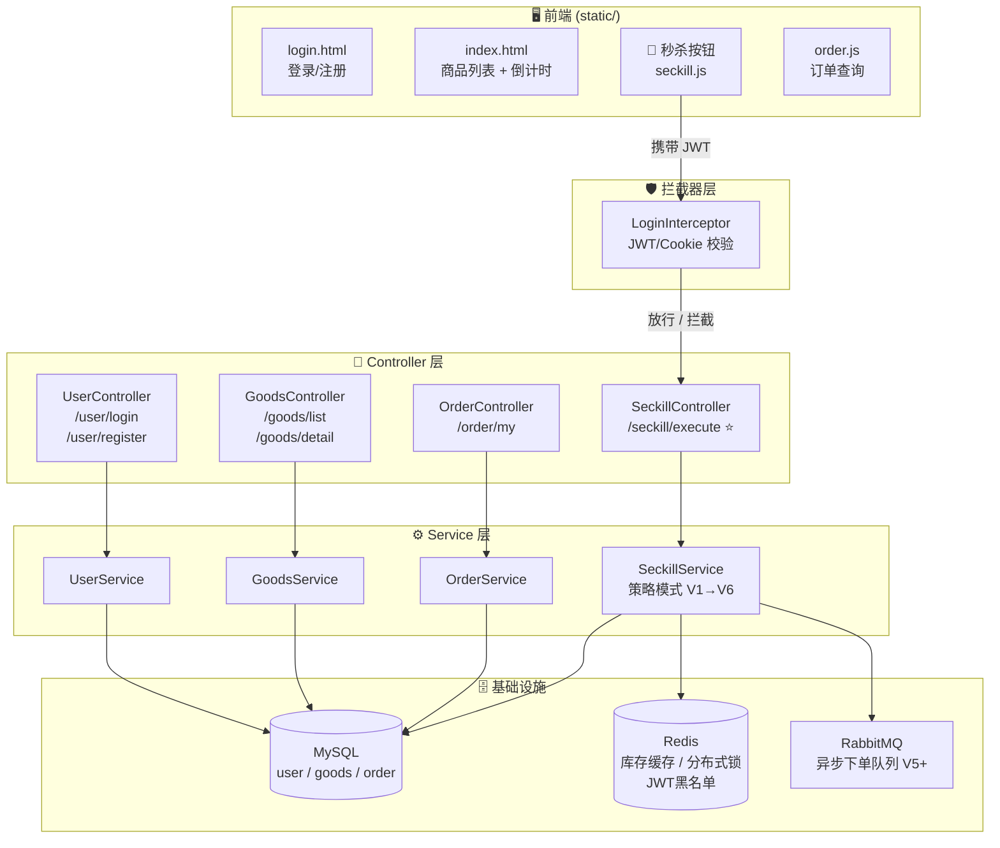

```mermaid
flowchart TB
    subgraph 前端["🖥️ 前端 (static/)"]
        login[login.html<br>登录/注册]
        index[index.html<br>商品列表 + 倒计时]
        btn[🔴 秒杀按钮<br>seckill.js]
        order[order.js<br>订单查询]
    end

    subgraph 拦截器["🛡️ 拦截器层"]
        interceptor[LoginInterceptor<br>JWT/Cookie 校验]
    end

    subgraph 控制器["📡 Controller 层"]
        userCtrl[UserController<br>/user/login<br>/user/register]
        goodsCtrl[GoodsController<br>/goods/list<br>/goods/detail]
        seckillCtrl[SeckillController<br>/seckill/execute ⭐]
        orderCtrl[OrderController<br>/order/my]
    end

    subgraph 服务层["⚙️ Service 层"]
        userSvc[UserService]
        goodsSvc[GoodsService]
        seckillSvc[SeckillService<br>策略模式 V1→V6]
        orderSvc[OrderService]
    end

    subgraph 基础设施["🗄️ 基础设施"]
        mysql[(MySQL<br>user / goods / order)]
        redis[(Redis<br>库存缓存 / 分布式锁<br>JWT黑名单)]
        mq[RabbitMQ<br>异步下单队列 V5+]
    end

    btn -->|携带 JWT| interceptor
    interceptor -->|放行 / 拦截| seckillCtrl

    seckillCtrl --> seckillSvc

    seckillSvc --> redis
    seckillSvc --> mysql
    seckillSvc --> mq

    orderCtrl --> orderSvc
    orderSvc --> mysql

    goodsCtrl --> goodsSvc
    goodsSvc --> mysql

    userCtrl --> userSvc
    userSvc --> mysql
```